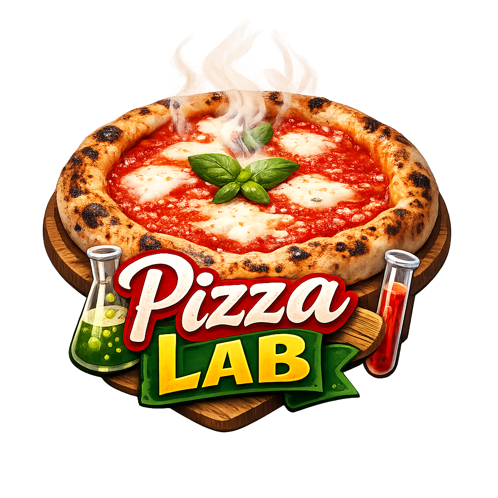

  

<h1 align="center">PizzaLab</h1>

  <strong>Calcolatore scientifico per impasti pizza</strong>

  
  
  
  
  
  
  
  
  
  
  
  

  

---

## Descrizione

PizzaLab e' un'app iOS gratuita per il **calcolo scientifico degli ingredienti** per impasti pizza. Calcola farina, acqua, sale, lievito e temperatura dell'acqua in base ai parametri scelti, e genera un procedimento dettagliato passo-passo.

I parametri sono allineati ai disciplinari ufficiali **AVPN** (Associazione Verace Pizza Napoletana) e **APITER** (Associazione Pizza in Teglia e Romana).

## Tipi di Pizza

- **Pizza Napoletana Verace** — Disciplinare AVPN 2024
- **Pizza Contemporanea** — Lunga maturazione
- **Pizza in Teglia** — Disciplinare APITER
- **Pizza Pala Romana** — Disciplinare APITER
- **Schiacciata Toscana** — Ricca di olio EVO
- **Pizza Fritta Napoletana** — Disciplinare AVPN

## Funzionalita'

- Wizard guidato a 4 step
- Metodo diretto e indiretto (biga)
- Selezione fermentazione: solo temperatura ambiente o frigo + ambiente
- Selezione tipo impastatrice con delta temperatura automatico
- Procedimento dettagliato con checkbox interattive
- Salvataggio ricette personalizzate
- Esportazione PDF professionale
- Indicatori di conformita' ai disciplinari
- Supporto unita' metriche e imperiali
- Modalita' chiara e scura
- Haptic feedback sulle selezioni
- Conferma prima di resettare il calcolatore

## Contatti

Per supporto, segnalazioni o suggerimenti: [Issues](https://github.com/dindonio/pizzalab-release/issues)

## Privacy

La [Privacy Policy](PRIVACY.md) e' disponibile in questo repository.

---

  <em>La scienza al servizio della pizza</em>

