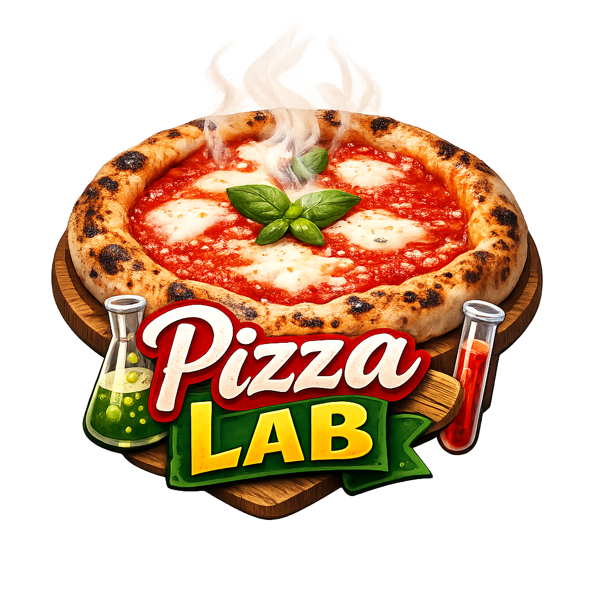

  

<h1 align="center">PizzaLab</h1>

  <strong>Calcolatore scientifico per impasti pizza</strong>

  
  
  
  
  
  
  
  
  
  
  
  

  

---

## Descrizione

PizzaLab e' un'app iOS gratuita per il **calcolo scientifico degli ingredienti** per impasti pizza. Calcola farina, acqua, sale, lievito e temperatura dell'acqua in base ai parametri scelti, e genera un procedimento dettagliato passo-passo.

I parametri sono allineati ai disciplinari ufficiali **AVPN** (Associazione Verace Pizza Napoletana) e **APITER** (Associazione Pizza in Teglia e Romana).

## Ricette

### Pizze
- **Pizza Napoletana Verace** — Disciplinare AVPN 2024
- **Pizza Contemporanea** — Lunga maturazione
- **Pizza in Teglia** — Disciplinare APITER
- **Pizza Pala Romana** — Disciplinare APITER
- **Schiacciata Toscana** — Ricca di olio EVO
- **Pizza Fritta Napoletana** — Disciplinare AVPN

### Altre Ricette Tradizionali
- **Casatiello Napoletano** — Calcolo automatico in base alle dimensioni del ruoto, procedimento completo in 7 fasi

## Funzionalita'

### Calcolo
- Wizard guidato a 4 step
- Metodo diretto, indiretto con **biga** e indiretto con **poolish** (lievito secondo la tabella Giorilli)
- Selezione fermentazione: solo temperatura ambiente o frigo + ambiente
- Selezione tipo impastatrice con delta temperatura automatico
- Indicatori di conformita' ai disciplinari
- Supporto unita' metriche e imperiali

### Timer di lievitazione
- **Timer a conferma**: a fine fase il timer si ferma e attende la tua conferma prima di avviare la fase successiva; promemoria se non confermi
- **Live Activity interattiva** su Lock Screen e Dynamic Island: Pausa, Riprendi e "Avvia prossima fase" senza aprire l'app
- **Sveglia a fine fase (iOS 26.1+)**: con AlarmKit suona come una sveglia di sistema anche in silenzioso o Full Immersion
- **Comandi Siri e Comandi Rapidi**: "Avvia la prossima fase in PizzaLab", "Metti in pausa il timer di PizzaLab", "Quanto manca in PizzaLab", "Annulla il timer di PizzaLab"
- Notifiche locali con pre-avviso 10 minuti prima della scadenza di ogni fase

### Pianifica l'infornata
- Scegli data e ora in cui vuoi infornare: l'app calcola a ritroso quando impastare, mettere in frigo e stagliare, tenendo conto di riposi e pieghe
- Promemoria 15 minuti prima e all'ora di iniziare

### Procedimento e ricette
- Procedimento dettagliato con checkbox interattive; lo schermo resta acceso mentre lo segui
- Salvataggio ricette personalizzate
- Esportazione PDF professionale e condivisione come testo
- **Guida farine** e **Glossario termini** in Impostazioni

### Lingue e accessibilita'
- Italiano e **inglese** (segue la lingua di iOS): i termini tecnici restano in italiano con la spiegazione accanto, es. "puntata (bulk fermentation)"
- **VoiceOver**, Dynamic Type e Riduci movimento, verificati con l'audit di accessibilita' di Apple
- Interfaccia Liquid Glass su iOS 26
- Modalita' chiara e scura, haptic feedback

### Sempre
- 100% offline: nessun account, nessuna pubblicita', nessuna raccolta dati

## Contatti

Per supporto, segnalazioni o suggerimenti: [Issues](https://github.com/dindonio/pizzalab-release/issues)

## Privacy

La [Privacy Policy](PRIVACY.md) e' disponibile in questo repository.

---

  <em>La scienza al servizio della pizza</em>

